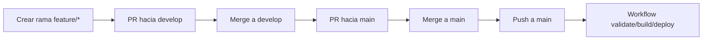

# 📝 Bitácora Tech

> Blog colectivo de tecnología construido con Jekyll, preparado para funcionar en local y publicarse en GitHub Pages.

Bitácora Tech reúne publicaciones de varias personas con intereses distintos dentro del mundo tech: desarrollo web, IA, ciberseguridad, hardware, gaming y más. El proyecto está pensado para ser fácil de mantener, claro de editar y cómodo para trabajar en equipo.

## 🧭 Índice rápido

- [Objetivo del proyecto](#-objetivo-del-proyecto)
- [Requisitos e inicio rápido](#️-requisitos)
- [Configuración del sitio](#️-configuración-del-sitio)
- [Flujo de trabajo colaborativo](#-flujo-de-trabajo-colaborativo)
- [GitHub Pages y despliegue](#-github-pages-y-despliegue)
- [Workflow de GitHub Actions](#-workflow-de-github-actions)
- [Buenas prácticas](#-buenas-prácticas-para-mantener-el-proyecto)

## 🎯 Objetivo del proyecto

El objetivo es crear un espacio simple, mantenible y fácil de publicar para compartir contenido técnico en formato de blog. La idea es que cada autor aporte desde su área de experiencia, manteniendo una base común de navegación, estilo y despliegue.

## ✨ Qué incluye este proyecto

- 🌐 Un sitio estático generado con Jekyll.
- 🎨 Un tema base `minima`.
- 📡 Soporte para feeds RSS con `jekyll-feed`.
- 🔎 Metadatos SEO con `jekyll-seo-tag`.
- 📚 Paginación de entradas con `jekyll-paginate`.
- 👤 Configuración de autores desde `_config.yml`.
- 🐳 Un entorno reproducible con Docker y Docker Compose.
- 🚀 Un flujo de despliegue automático a GitHub Pages mediante GitHub Actions.
- ✅ Validaciones automáticas de contenido, dependencias y compilación.

## 📁 Estructura del repositorio

```text
Survsite/
├── .github/
│   └── workflows/
│       └── deploy-pages.yml
├── _config.yml
├── README.md
├── Dockerfile
├── docker-compose.yml
├── Makefile
├── blog-tech/
│   ├── Gemfile
│   ├── Gemfile.lock
│   ├── _config.yml
│   ├── _includes/
│   ├── _layouts/
│   ├── _posts/
│   ├── about.md
│   ├── index.md
│   └── assets/
└── .cspell.json
```

### Archivos clave

- `_config.yml`: configuración global del sitio y del blog.
- `blog-tech/_config.yml`: configuración específica del contenido del blog.
- `blog-tech/index.md`: página de inicio.
- `blog-tech/about.md`: página de presentación del proyecto y del equipo.
- `blog-tech/Gemfile`: dependencias Ruby y Jekyll.
- `blog-tech/_posts/`: carpeta donde viven los artículos.
- `.github/workflows/deploy-pages.yml`: workflow de validación y despliegue.

## 🛠️ Requisitos

Para trabajar con este proyecto necesitas:

- Git
- Docker y Docker Compose (recomendado)
- O bien Ruby + Bundler si prefieres trabajar sin contenedor

### Versión recomendada

- Ruby 3.2
- Bundler 2.x
- Node.js 22 para las tareas de validación ortográfica

## ▶️ Inicio rápido

### Opción A: con Docker (recomendada)

La forma más sencilla y reproducible para levantar el sitio localmente es esta:

```bash
cd /ruta/al/proyecto/Survsite
docker compose up --build
```

Después abre el navegador en:

```text
http://127.0.0.1:4000
```

Para detenerlo:

```bash
docker compose down
```

Para ver los logs:

```bash
docker compose logs -f
```

### Opción B: con Ruby y Bundler

Si prefieres ejecutar Jekyll directamente en tu máquina:

```bash
cd blog-tech
bundle install
bundle exec jekyll serve
```

Y visita:

```text
http://localhost:4000
```

### Comandos útiles

- `bundle install`: instala las dependencias del proyecto.
- `bundle exec jekyll serve`: levanta el sitio en modo desarrollo.
- `bundle exec jekyll build`: genera una compilación estática en `_site`.
- `docker compose up --build`: levanta el entorno completo con Docker.
- `make`: ejecuta la tarea de arranque definida en el Makefile.

## ⚙️ Configuración del sitio

El archivo `_config.yml` centraliza la mayoría de los valores globales. El contenido del blog vive bajo `blog-tech/` y usa su propia configuración en `blog-tech/_config.yml`.

### Autores

Los autores se definen en la sección `authors:`. Cada entrada debe incluir al menos:

- `name`
- `bio`

Ejemplo:

```yaml
authors:
  juanjo:
    name: "Juanjo Morales"
    bio: "Ingeniero de sistemas"
```

### Tema y plugins

El blog usa:

- `theme: minima`
- `jekyll-feed`
- `jekyll-seo-tag`
- `jekyll-paginate`

## ✍️ Cómo crear contenido

### Crear una nueva entrada

Cada post debe guardarse dentro de `blog-tech/_posts/` con este formato:

```text
AAAA-MM-DD-titulo-del-post.md
```

### Front matter mínimo

Cada entrada debe empezar con un bloque YAML como este:

```yaml
---
layout: post
title: "Título del artículo"
date: 2026-08-01 10:00:00 -0400
author: juanjo
categories: [desarrollo]
tags: [jekyll, github-pages]
---
```

### Reglas recomendadas

- El valor de `author` debe coincidir con una clave existente en `_config.yml`.
- Usa `categories` para agrupar temas generales.
- Usa `tags` para etiquetas más específicas.
- Mantén el contenido en Markdown y revisa enlaces internos antes de publicar.

### Ejemplo de post

```markdown
---
layout: post
title: "Primer artículo"
date: 2026-08-01 10:00:00 -0400
author: mauro
categories: [devops]
tags: [jekyll, blog, github-pages]
---

En este artículo explicamos cómo publicar un blog técnico con Jekyll.
```

## 🔄 Flujo de trabajo colaborativo

Este proyecto usa un flujo claro y seguro basado en ramas y Pull Requests.

### Ramas del proyecto

- `main`: rama de producción. Es la fuente de verdad para el sitio publicado.
- `develop`: rama de integración y validación previa.
- `feature/*`: ramas temporales para trabajar cambios concretos.

### Proceso recomendado

1. Crear una rama `feature/*` desde `develop`.
2. Trabajar cambios pequeños y enfocados.
3. Hacer commits claros y descriptivos.
4. Abrir un Pull Request hacia `develop` para revisar y validar.
5. Cuando todo esté listo, abrir un Pull Request desde `develop` hacia `main`.
6. Al hacer merge a `main`, el workflow de despliegue se ejecuta y publica el sitio.

### Ejemplo de flujo local

```bash
git checkout develop
git pull origin develop
git checkout -b feature/nombre-del-cambio

# trabajar en los cambios

git add .
git commit -m "feat: describe el cambio"
git push -u origin feature/nombre-del-cambio
```

Luego, abre un PR hacia `develop`. Cuando esté listo para producción, abre otro PR desde `develop` hacia `main`.

## 🧭 Guía rápida para contribuir

Si vas a participar en el proyecto, sigue este flujo para que los cambios lleguen de forma ordenada:

1. Crear una rama `feature/*` desde `develop`.
2. Trabajar cambios pequeños y bien delimitados.
3. Probar el sitio localmente antes de abrir el PR.
4. Abrir un Pull Request hacia `develop`.
5. Esperar revisión y resolver comentarios si los hay.
6. Cuando todo esté listo, abrir otro PR desde `develop` hacia `main`.

### Checklist antes de pedir revisión

- [ ] El sitio compila correctamente en local.
- [ ] Los cambios no han roto enlaces ni rutas.
- [ ] El contenido está bien redactado y sin errores obvios.
- [ ] El PR tiene título y descripción claros.
- [ ] Si se cambiaron posts, se han revisado los front matter y la ortografía.

### Diagrama del flujo de publicación



### Plantilla recomendada para un PR

```text
## Qué cambia
- Describe brevemente los cambios introducidos.

## Por qué
- Explica el problema o la mejora que resuelve.

## Cómo se ha validado
- Indica si has probado el sitio localmente.
- Menciona comandos ejecutados o resultados obtenidos.
```

## 📝 Publicar un nuevo post paso a paso

Si quieres añadir una entrada nueva al blog, sigue este proceso:

1. Crear una rama `feature/*` desde `develop`.
2. Crear un archivo nuevo en `blog-tech/_posts/` con el nombre `AAAA-MM-DD-titulo-del-post.md`.
3. Añadir el front matter mínimo con `layout`, `title`, `date`, `author`, `categories` y `tags`.
4. Escribir el contenido en Markdown.
5. Comprobar que el autor existe en `_config.yml`.
6. Probar el sitio localmente con `bundle exec jekyll build` o `docker compose up --build`.
7. Abrir un PR hacia `develop` y, si todo está bien, seguir el flujo hasta `main`.

### Ejemplo de publicación

```bash
cd /ruta/al/proyecto/Survsite
git checkout develop
git pull origin develop
git checkout -b feature/nuevo-post
cp blog-tech/_posts/2026-08-01-bienvenida-bitacora-tech.md blog-tech/_posts/2026-08-02-mi-nuevo-post.md
```

Luego editas el archivo nuevo con el contenido deseado y sigues el flujo habitual.

### Plantilla de front matter recomendada

```yaml
---
layout: post
title: "Título del post"
date: 2026-08-01 12:00:00 +0000
author: nombre-del-autor
categories: [general]
tags: [jekyll, github-pages]
---
```

### Checklist antes de publicar

- [ ] el archivo está en `blog-tech/_posts/` con el formato correcto;
- [ ] el front matter está bien cerrado y sin errores de sintaxis;
- [ ] el author existe en `_config.yml`;
- [ ] el contenido se ve bien en local;
- [ ] no hay errores visibles en la construcción del sitio;
- [ ] el PR describe claramente qué se publica y por qué.

## 🌐 GitHub Pages y despliegue

GitHub Pages sirve el sitio como contenido estático. En este proyecto, el contenido se compila con Jekyll y se publica automáticamente desde GitHub Actions.

### Configuración recomendada en GitHub

En la sección Settings → Pages del repositorio:

- selecciona la opción `GitHub Actions` como fuente de despliegue;
- asegúrate de que la rama `main` sea la base del despliegue;
- comprueba que el workflow haya terminado correctamente antes de esperar cambios visibles.

### URL típica

Para un repositorio público, la URL suele tener este patrón:

```text
https://<usuario>.github.io/<nombre-del-repositorio>/
```

Si el repositorio pertenece a una organización o cuenta de usuario, la URL puede ser la raíz del dominio de GitHub Pages.

## 🚀 Workflow de GitHub Actions

El archivo [.github/workflows/deploy-pages.yml](.github/workflows/deploy-pages.yml) define el pipeline de despliegue.

### Qué hace el workflow

El workflow se activa cuando hay un push a `main`, es decir, cuando el cambio ya quedó reflejado en la rama principal tras el merge del PR desde `develop`.

### Jobs del workflow

1. `validate`
   - comprueba que el workflow se haya ejecutado sobre `main`;
   - instala Node.js 22;
   - ejecuta `cspell` sobre los posts en español;
   - instala las dependencias de Ruby/Bundler;
   - ejecuta `bundle exec jekyll doctor`;
   - compila el sitio con `bundle exec jekyll build --trace`.

2. `build`
   - depende de `validate`;
   - vuelve a compilar el sitio con Jekyll;
   - prepara el artefacto estático para publicar en Pages.

3. `deploy`
   - depende de `build`;
   - publica el contenido generado en GitHub Pages mediante `actions/deploy-pages`.

### Permisos del workflow

El workflow usa estos permisos:

- `contents: read`
- `pages: write`
- `id-token: write`

Estos permisos son necesarios para que GitHub Actions pueda construir y publicar el sitio en Pages.

### Concurrencia

El workflow usa `concurrency` para evitar ejecuciones simultáneas innecesarias:

- `group: pages`
- `cancel-in-progress: true`

Esto evita que dos despliegues compitan entre sí.

## 🧪 Validación local recomendada antes de abrir un PR

Antes de pedir revisión, conviene comprobar al menos estas cosas:

```bash
cd blog-tech
bundle exec jekyll build
```

Y si quieres una verificación rápida del contenido:

```bash
npx cspell --config ../.cspell.json --no-progress --words-only --locale es "_posts/**/*.md"
```

## 🧰 Solución de problemas frecuentes

### El sitio no se abre en `http://localhost:4000`

- verifica que Jekyll siga corriendo;
- comprueba que no haya otro proceso usando el puerto 4000;
- revisa los logs con `docker compose logs -f` si usas Docker;
- prueba a reconstruir el contenedor con `docker compose up --build`.

### Un post no aparece

- asegúrate de que el archivo esté dentro de `blog-tech/_posts/`;
- revisa que el nombre del archivo siga el formato `AAAA-MM-DD-titulo.md`;
- comprueba que el front matter esté bien cerrado y que no falten comillas;
- verifica que el valor de `author` exista en `_config.yml`.

### El despliegue no funciona

- revisa la pestaña Actions del repositorio;
- comprueba que el workflow haya pasado en `main`;
- confirma que en GitHub Pages la fuente sea `GitHub Actions`;
- verifica que el workflow tenga permisos adecuados para Pages;
- revisa si el merge se hizo realmente sobre `main` y si el push asociado llegó correctamente.

### El workflow falla en `cspell`

- comprueba que los archivos de post estén en la ruta esperada;
- revisa si hay palabras no reconocidas y, si procede, añádelas a `.cspell.json`;
- vuelve a ejecutar el comando localmente para ver el detalle exacto.

## 🧭 Buenas prácticas para mantener el proyecto

- mantener mensajes de commit claros;
- abrir PR pequeños y bien descritos;
- probar el sitio antes de fusionar a `develop`;
- no trabajar directamente sobre `main`;
- revisar ortografía y enlaces antes de publicar.

## 🚀 Próximos pasos sugeridos

- añadir más artículos y autores;
- mejorar la identidad visual con estilos propios;
- configurar un dominio personalizado en GitHub Pages;
- ampliar la validación con enlaces rotos o previews automáticas.
